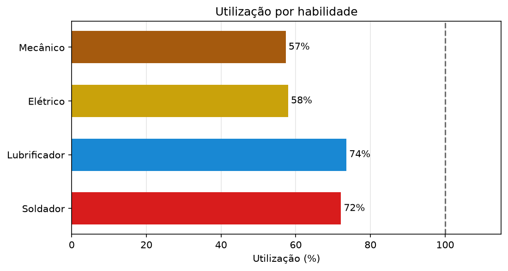
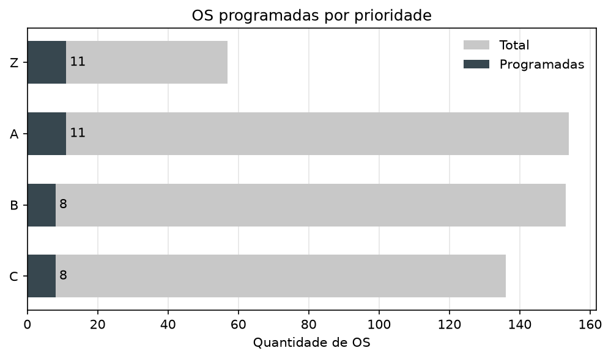
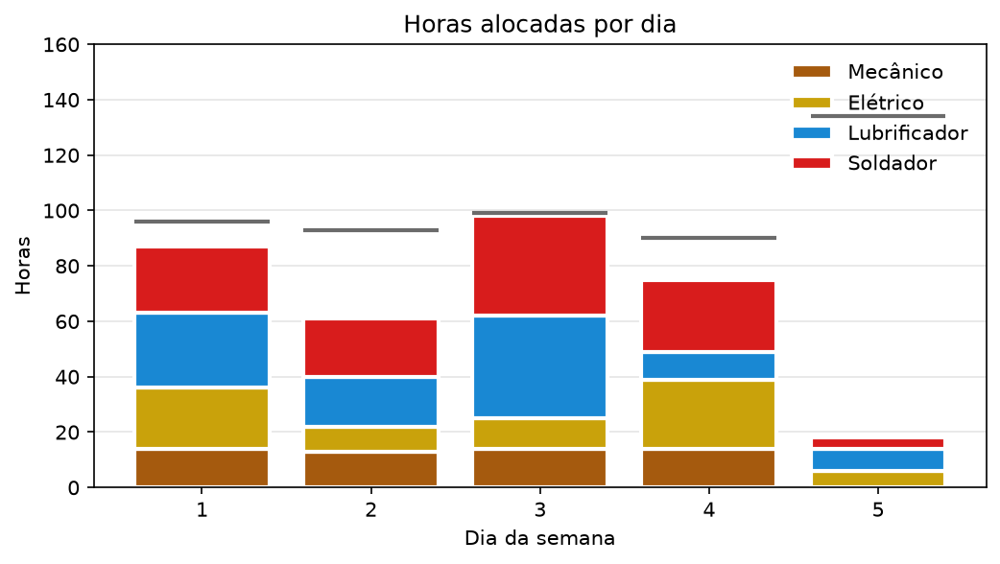

# Relatório Técnico

Desafio de programação semanal de manutenção para vaga de estágio no iOptimum da IndustriALL.

## 1. O problema

O desafio pede uma programação semanal de manutenção, que consiste em decidir quais ordens de serviço serão executadas em cada um dos cinco dias da semana. A programação precisa respeitar as horas disponíveis de cada habilidade em cada dia, os dias em que a planta está parada e a ordem entre OS que dependem umas das outras. O objetivo é executar o maior número possível de OS, dando preferência às mais críticas (ordem Z > A > B > C) e utilizar ao máximo os recursos.

## 2. Análise dos dados

No backlog de 500 OS existem 25.751 horas de trabalho para 512 horas de capacidade na semana, ou seja, a capacidade cobre 2% do que está pedido (e nos backlogs de 1000 e 2000 a proporção é ainda menor).

Isso muda a natureza do problema, pois não se trata de encaixar tudo da melhor forma, e sim de escolher bem o pequeno conjunto de OS que vai ser programado. Programar poucas OS não é um sinal de que a solução falhou, pois é o resultado correto dado o tamanho do backlog. Essa constatação orientou todas as decisões seguintes, já que o critério de ordenação passa a importar muito mais do que a eficiência em si.

## 3. Premissas

A especificação deixa alguns pontos em aberto, então precisei decidir por conta própria. As decisões estão listadas abaixo junto com o motivo de cada uma.

- Uma tarefa gasta duração vezes quantidade em horas, e esse número conta duas vezes, uma no tempo que a OS leva e outra no consumo da habilidade. Não considerei execução em paralelo porque o enunciado descreve essas horas como
disponibilidade dos executantes, mas nunca informa quantos executantes existem. Como por exemplo 19 HH de Mecânico num dia podem ser dois executantes em um turno inteiro ou três em turno parcial, não teria como afirmar que existem três mecânicos livres ao mesmo tempo
para uma tarefa de quantidade 3. Sem esse dado, não teria como sustentar que várias pessoas fazem a mesma tarefa ao mesmo tempo.

- Cada OS entra na programação uma vez só, com um único dia de início. Se a execução passar de 8 horas, ela continua nos dias seguintes, sem intervalo entre eles.

- OS com condição de parada ficam restritas a execução apenas durante os dias de parada e as de operando podem cair em qualquer dia da semana.

- Uma OS sucessora só começa depois que a predecessora termina, do dia seguinte em diante, e se a predecessora não entrou na programação, a sucessora fica de fora junto.

- Considerei que uma OS só conta como programada se ela termina dentro da semana, pois, apesar de a especificação não dizer isso de forma explícita, o objetivo é maximizar a quantidade de OS executadas, e uma OS que passasse do quinto dia não teria sido executada naquela semana, então contar ela acaba superestimando o resultado com trabalho que não aconteceu realmente.

## 4. A heurística

A solução é uma heurística construtiva gulosa, no formato parecido com o que, a partir do que pesquisei, na área de Pesquisa Operacional chamam de Serial Schedule Generation Scheme (SSGS). As OS são ordenadas uma vez e depois cada uma recebe o primeiro dia em que couber, sem que nada seja reconsiderado depois de já alocado.

A ordenação usa prioridade como critério principal, na ordem Z > A > B > C, e menor horas totais como desempate. O desempate por menor horas totais vem do objetivo, pois quando o que queremos é maximizar a quantidade de OS executadas, encaixar as menores primeiro faz caber mais OS dentro da mesma capacidade.

O loop externo repete passes até que nenhuma OS nova seja programada, e ele precisa existir porque a ordenação por prioridade não diz respeito às dependências entre as OS. No backlog de 500, das 93 OS que tem predecessora, 49 aparecem antes dela na lista ordenada, como a OS_39 de prioridade A que depende da OS_29 de prioridade C e está 391 posições à frente. Se o algoritmo fizesse uma iteração só, essas 49 seriam puladas por ainda não terem a predecessora programada, e quando ela finalmente fosse programada o loop já teria passado por elas, então nunca mais seriam revisitadas. Por isso que repeti as iterações até que uma delas não consiga mais programar nenhuma OS.

As restrições entram na verificação de cada tentativa de programar uma OS:
- A função `layout_os` distribui as tarefas da OS pelos dias a partir do dia de início e devolve as horas consumidas de cada habilidade em cada dia, ou nada se a OS não couber até o dia 5.
- A `verifica_parada()` confere se os dias ocupados são todos dias de parada, quando a OS exige parada.
- A `verifica_consumo()` confere se as horas cabem na capacidade restante.
- A restrição de predecessora é tratada antes disso, na definição do dia mínimo de início.

## 5. Validação

Importante ressaltar que solução que parece certa não é o mesmo que uma solução comprovadamente válida. A `build_schedule()` confere as restrições no momento de programar cada OS, então um erro dentro dessas verificações produziria uma solução inválida sem que fosse possível perceber.

Por isso escrevi um validador separado e independente no `validator.py` que recebe a solução pronta e
confere denovo tudo do zero. Ele não reutiliza nenhuma função do `scheduler.py` e o novo cálculo vai por um caminho propositalmente diferente: enquanto o scheduler percorre as tarefas com um loop que vai preenchendo 8 horas por dia, o validador organiza as tarefas em
uma lista hora a hora e descobre o dia de cada hora dividindo o índice por 8.

Só que tem uma questão: um validador que não acusa erros (não cumprimento das restrições) é a mesma coisa de um validador correto, já que os dois devolvem uma lista de erros vazia ao receber uma solução válida. Para provar que ele realmente acusa os erros da solução, escrevi seis testes, em que cada um executa o seguinte pipeline:
- 1: parte da solução gerada
- 2: quebra uma restrição de propósito
- 3: verifica se a violação correspondente foi acusada 

Além desses seis, tem o teste de controle, que faz o contrário e confirma que a solução intacta não gera violação nenhuma. Os dois tipos de teste são necessários, pois um validador que acusasse qualquer coisa passaria nos seis primeiros e um que nunca acusasse nada passaria no de controle.

Para conferir que os próprios testes funcionam, desativei cada uma das sete checagens do validador uma por vez e confirmei que o teste correspondente falha em todos os casos, o que garante que nenhuma parte do validador pode quebrar sem avisar explicitamente.

Nos três backlogs o validador acusa zero erros, ou seja, nenhuma OS programada não cumpre as restrições.

## 6. Resultados

| Backlog | Programadas | Z | A | B | C | Violações |
|--------:|------------:|--:|--:|--:|--:|----------:|
| 500 | 38 de 500 | 11 | 11 | 8 | 8 | 0 |
| 1000 | 54 de 1000 | 17 | 17 | 10 | 10 | 0 |
| 2000 | 61 de 2000 | 23 | 22 | 13 | 3 | 0 |

Utilização das horas disponíveis:

| Backlog | Mecânico | Elétrico | Lubrificador | Soldador |
|--------:|---------:|---------:|-------------:|---------:|
| 500 | 57% | 58% | 74% | 72% |
| 1000 | 97% | 91% | 93% | 95% |
| 2000 | 98% | 93% | 98% | 96% |

Os números vêm do `scripts/resultado.py`, que roda os três backlogs e imprime as tabelas acima no terminal.

O primeiro gráfico mostra que nenhuma habilidade chega perto de utilizar todas suas horas no backlog de 500.

O segundo mostra o critério de prioridade, onde, das 57 OS de prioridade Z existentes, 11 entraram, o que dá 19%, enquanto das 136 de prioridade C entraram 8, ou seja 6%. A
proporção de OS críticas atendidas é três vezes maior.

O terceiro mostra as horas usadas em cada dia, organizadas por habilidade, com uma linha marcando a capacidade disponível. É possível ver a diferença entre o uso e a capacidade e como ela se concentra no dia 5.

## 7. Análise dos resultados

Programar 38 de 500 OS parecia pouco quando vi o resultado pela primeira vez, então investiguei por que as outras 462 ficaram de fora.

| Backlog | Fora | Passa do teto da semana | Predecessora fora | Sem espaço |
|--------:|-----:|------------------------:|------------------:|-----------:|
| 500 | 462 | 298 (65%) | 40 (9%) | 124 (27%) |
| 1000 | 946 | 569 (60%) | 93 (10%) | 284 (30%) |
| 2000 | 1939 | 1171 (60%) | 159 (8%) | 609 (31%) |

Entre 60% e 65% das OS não programadas precisam de mais de 40 horas de trabalho e, pela premissa de que uma OS só conta se terminar dentro da semana, elas são inviáveis por natureza, já que uma OS avança no máximo 8 horas por dia e a semana tem 5 dias, então elas não caberiam nem em uma semana inteiramente disponível. Importante ressaltar que essa proporção é consequência direta da premissa que adotei, pois se eu tivesse assumido execução em paralelo boa parte dessas OS caberia.

A segunda observação é sobre a diferença entre horas usadas e capacidade no backlog de 500. O loop da heurística só termina quando uma iteração não consegue programar mais nenhuma OS, então quando ela para já não existe nenhuma OS que possa ser programada em nenhum dia, e a diferença entre horas e capacidade não é alguma possibilidade de programação de OS que passou despercebida. A explicação está em onde essa diferença ficou, pois das 173 horas que sobraram 116 estão no dia 5, e para uma OS ser programada no último dia ela precisa terminar dentro dele, ou seja precisa de 8 horas ou menos, e entre as 377 OS elegíveis apenas duas são desse tamanho, a OS_160 e a OS_234, que por serem de parada não podem ser executadas em dias fora de 3 e 4, que já estão ocupados. Todas as demais OS precisam de mais de 8 horas e passariam do limite da semana se começassem no dia 5.

A terceira observação vem da comparação entre os três backlogs. A utilização sobe de 57% no menor para 98% no maior, e isso mostra que a diferença entre horas usadas e capacidade do primeiro caso é limitação do backlog e não da heurística. Com poucas OS disponíveis não existem OS pequenas suficientes para preencher os espaços que sobram, e conforme o backlog cresce esses espaços passam a ser preenchidos. Vale observar também que no backlog de 2000 a prioridade C cai para 3 OS programadas enquanto a Z sobe para 23, ou seja, quanto maior a concorrência proporcionada por maior número de OS, melhor o critério de prioridade funciona contra as classes de menor criticidade.

## 8. Limitações e próximos passos

A heurística é gulosa, então ela toma a melhor decisão local a cada passo e nunca reconsidera o que já fez. Neste problema dá para apontar onde isso custa, pois como
cada OS entra no dia mais cedo em que couber, os dias 1 a 4 enchem primeiro e o dia 5 fica com a maior parte da diferença entre horas usadas e capacidade, e são justamente os dias 3 e 4 que as OS de parada
disputam.

A especificação permite usar métodos de otimização a partir de uma solução inicial própria e cheguei a considerar isso, mas decidi não implementar. A diferença que sobra entre as horas usadas e capacidade é pequena e está concentrada justamente no dia que as OS restantes não podem usar, como mostrei na seção anterior, então o ganho seria pequeno diante do tempo que tomaria e a complexidade da modelagem e implementação. Acredito que o gargalo maior é na questão de que a maior parte das OS não programadas não caberia na semana de jeito nenhum, e isso nenhuma busca resolveria.

Se fosse continuar, eu partiria de uma busca local sobre esta solução para trabalhar sobre uma solução por vez e poder reaproveitar as mesmas funções de verificação que já existem no código, o que garantiria que nenhum movimento gere uma programação inválida. Acredito que o movimento não seria de inserção (programação de uma OS), já que o loop em `build_schedule()` esgota todas as inserções possíveis, e sim de tirar uma OS já programada e recolocá-la em outro dia para abrir espaço onde falta.

## Onde encontrar cada item do projeto

- O repositório contém o código, os testes e os gráficos
- A função `create_solution` está em
`src/main.py` e devolve o dicionário no formato pedido
- Os testes estão em `tests/test_validator.py` e rodam tanto como script quanto pelo pytest
- As tabelas do relatório podem ser reproduzidas com `python scripts/resultado.py`
